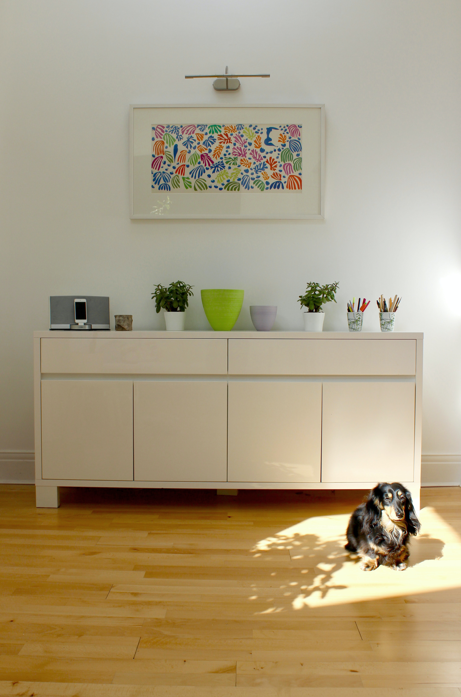
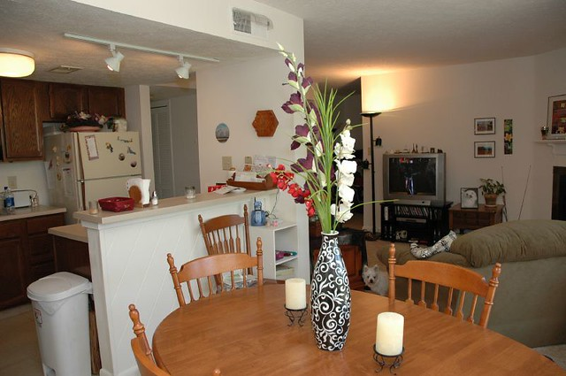
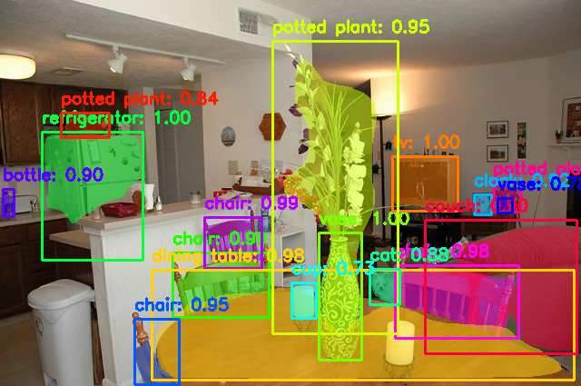
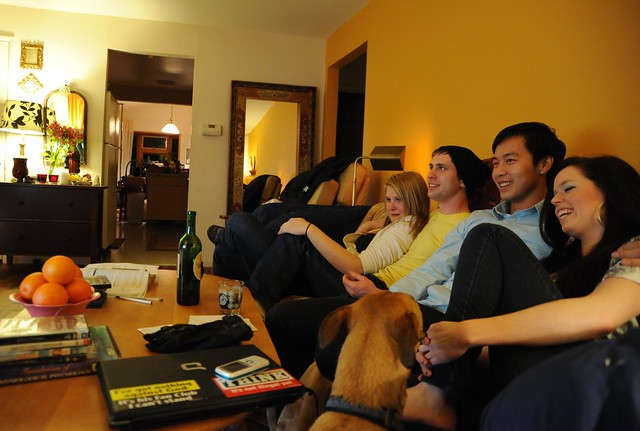
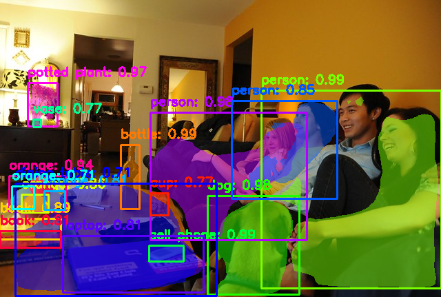
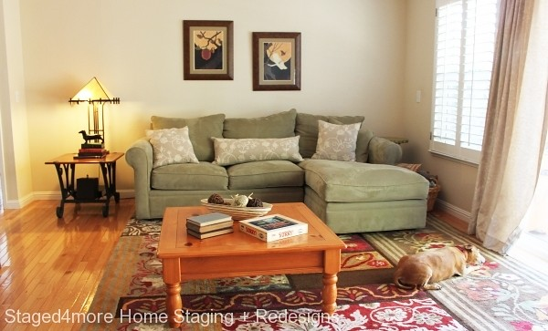
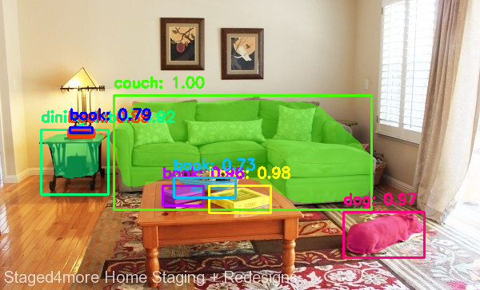
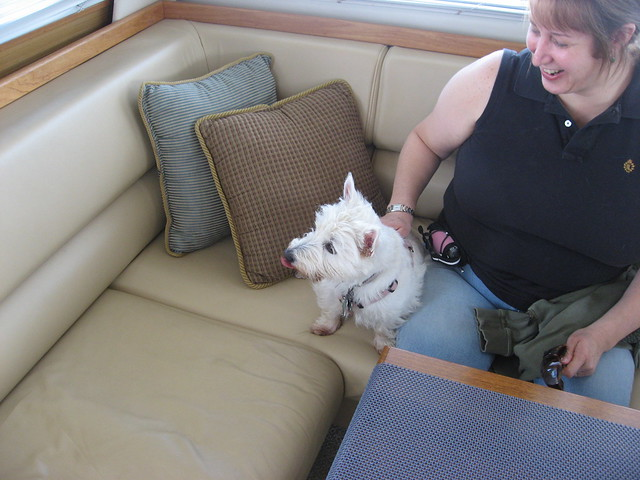
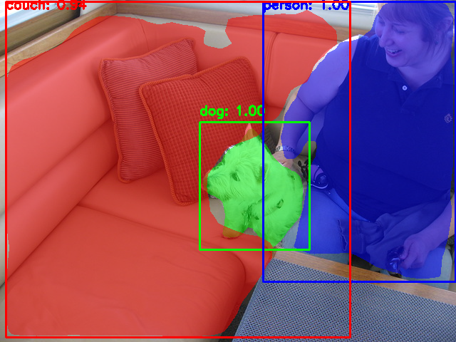

# Instance_Segmentation_Mask_RCNN
To perform instance segmentation using Mask R-CNN and Python

## Overview
I'll be using the Mask R-CNN architecture to perform instance segmentation on images, video and live web-cam feed.
The Mask R-CNN architecture is an extension of the Faster R-CNN architecture. It uses ResNet101 as backbone(It also supports ResNet50).  

You can find more details about the working and functionality of the code from my article given [here](https://towardsdatascience.com/image-segmentation-using-mask-r-cnn-8067560ed773).

 

## Arguments
```
    --image                 ---->   Path to the test image
    --model_path            ---->   Path to the model directory
    --model_name            ---->   Name of the model file 
    --class_names           ---->   Path to the class labels 
    --mrcnn_visualize       ---->   Use the built-in visualize method  
    --instance_segmentation ---->   To toggle between semantic and instance segmentation             
    --draw_bbox             ---->   Draw the bounding box with class labels  
    --camera                ---->   Perform live detection  
    --video                 ---->   Path to video file
    --save_enable           ---->   Enable to save processed image or video  
```

## Usage
* For testing on images  
`python mask.py --image <path to image>  --save_enable True/False --model_path <path to the model directory> --model_name <name of the model> --class_names <path to the class labels file>`

* For testing on videos  
`python mask.py --video <path to video file> --save_enable True/False --model_path <path to the model directory> --model_name <name of the model> --class_names <path to the class labels file>`

* For testing on web-cam feed  
`python mask.py --camera True --model_path <path to the model directory> --model_name <name of the model> --class_names <path to the class labels file>`

The program by default looks for the model in the `models` folder and specifically for the `mask_rcnn_coco.h5` file.

## Sample Outputs
   
   
 
 

## Notes
* Do note that the code for Mask R-CNN was obtained from Matterport's [repository](https://github.com/matterport/Mask_RCNN).
* For more details regarding the Mask RCNN implementation visit the link given or read the MRCNN_README file. The files mask.py, mask_colab.py and Mask_On_Colab.ipynb, models, my_images are mine. 


Star ⭐️ this repo if you find it helpful :)
